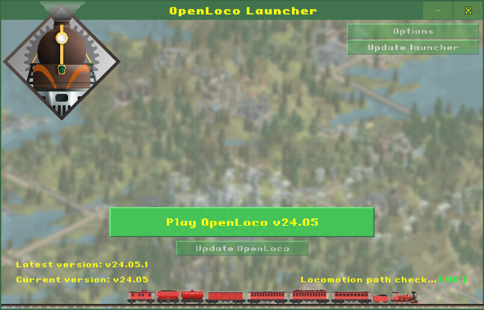

# OpenLoco Launcher

A launcher for automatically downloading the latest [OpenLoco](https://github.com/OpenLoco/OpenLoco) with several aditional functions.

### Features

* Automatically detect *Locomotion* installation path and configure OpenLoco to use it (user no longer needs to manually set path).  
* Easily download latest *OpenLoco* version.  
* Automatically start the game if no updates available.  

# 🚀 Installation
1. Download the latest version of the launcher from the [Releases page](https://github.com/shusaura85/openlocolauncher/releases).
2. Save the file anywhere on your system and extract it.
3. Run **OpenLoco Launcher.exe**

# 🔨 Building

**Open Launcher** is written in Delphi 10.3 but should be compileable with any version starting with Delphi XE2 and newer.  

### Prerequisites
* [Delphi](https://www.embarcadero.com/products/delphi/starter)
  * TShuImgButton (components dir) must be installed in Delphi  
* [Indy Components](https://www.indyproject.org/) (optional - installed by default in Delphi)
  * [OpenSSL DLLs](https://github.com/IndySockets/OpenSSL-Binaries) (needed for HTTPS connections)

# ⚖️ Licence
**OpenLoco Launcher** is licensed under the MIT License.